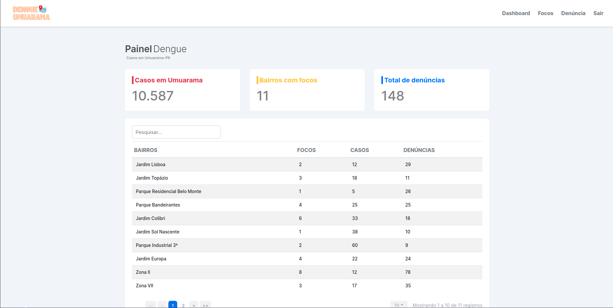

<h1 align="center">
  
</h1>

<p align="center">
  <a href="#-technologies">Technologies</a>&nbsp;&nbsp;&nbsp;|&nbsp;&nbsp;&nbsp;
  <a href="#-project">Project</a>&nbsp;&nbsp;&nbsp;|&nbsp;&nbsp;&nbsp;
  <a href="#-how-to-begin">How to begin</a>&nbsp;&nbsp;&nbsp;|&nbsp;&nbsp;&nbsp;
  <a href="#-development">Development</a>
</p>

<br>

<p align="center">
  
</p>

## ✨ Technologies

This project was developed with the following technologies:

<p>
  <a href="https://reactjs.org">
    
  </a>
  <a href="https://developer.mozilla.org/pt-BR/docs/Web/JavaScript">
    
  </a>
  <a href="https://developer.mozilla.org/pt-BR/docs/Web/CSS">
    
  </a>
  <a href="https://sass-lang.com/documentation">
    
  </a>
</p>

## 💻 Project

Dengue Umuarama is an administrative panel.

## 🚀 How to begin

Create the admin-panel folder

```console
$ mkdir admin-panel
```

In the admin panel, clone the repository:

```console
# HTTPS
$ git clone https://github.com/WebDev-Dengue/web.git .

# or

# SSH
$ git clone git@github.com:WebDev-Dengue/web.git .
```

Install Yarn

```console
$ yarn install
```

Run the project

```console
$ yarn dev
```

You can now access [`localhost:3000`](http://localhost:3000) from your browser.

## 📄 Development

This project was developed by
<a href="http://linkedin.com/in/edsonjuniornarvaes">
<br>

</a>

---
